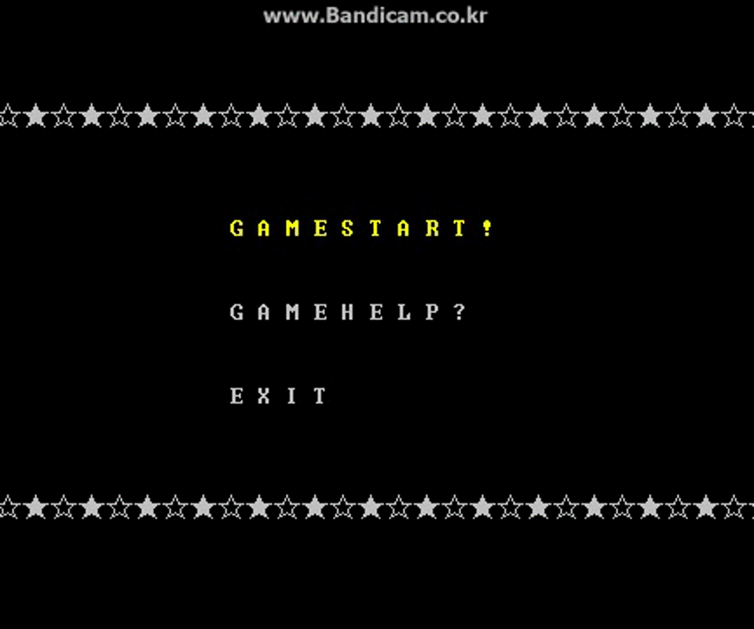

# 포즈게임

## 1. 연구목적
 -  프로그래밍 능력향상
 -  조별 임무분담을 통한 실무능력 향상
 -  조원 간 효율적인 커뮤니케이션 능력배양 
 -  프로그램 구현을 위해 관련이론을 습득하고 실질적으로 적용하는 능력배양

## 2. 설계과제의 필요성 
본 설계과제를 통해서 조원 간 커뮤니케이션을 통해 효율적인 업무분담과 실질적인 실무능력향상을 기대할 수 있다.   
 또한 프로그램 구현을 위해 관련이론을 습득하고 실질적으로 적용하는 능력향상을 기대할 수 있으며, 이는 곧 프로그래밍 능력향상으로 이어질 수 있다.

## 3. 설계과제의 목표
아래 예와 같이 본 설계과제가 달성하고자 하는 목표를 제시하였다.
본 과제가 달성하고자 하는 프로그램적 성능 목표는 다음과 같다.

- 프로그램 최적화 : 함수의 묘듈화

- 프로그램 편의성 확보 : 프로그램 구동성 편의 확보
	- 직관적인 유저인터페이스(UI) 실현

- 구현하고자 하는 기능 : 게임이해를 돕는 도움말 기능
	- 게임 승리조건 제시
	- 승리조건달성 시 승리출력

## 4. 설계과정

- 설계 기초이론
	- 함수모듈화
		프로그램 최적화를 위해 사용하는 프로그래밍 개념이다 모듈화가 가지는 조건은 다음과 같다
		- 다른 것들과 구별될 수 있는 독립적인 기능을 갖는 단위(unit)이다.
		- 유일한 이름을 가져야 한다.
		- 독립적으로 컴파일이 가능하다.
		- 모듈에서 또 다른 모듈을 호출할 수 있다.
		- 다른 프로그램에서도 모듈을 호출할 수 있다.
		- 모듈은 완전한 독림 프로그램이고, 다양한 크기의 집합에 대해서 모듈이라고 할 수 있다.
	- 멀티스레드
		CPU 시간을 할당받아 프로세스 메모리 영역에 있는 코드를 수행하고 데이터를 사용하는 동적인 개념
		- 메인스레드는 응용 프로그램 실행 시 최초로 생성되는 스레드이다.
		- 멀티스레드는 주 스레도와 별도로 동시에 수행되는 여러 작업이 있는 응용 프로 그램이다

- ### 일부 기능들

---

#### 시스템로딩

---

#### 메뉴선택화면

---

#### 게임로딩

...더 많은 내용은 ppt와 최종보고서 참고