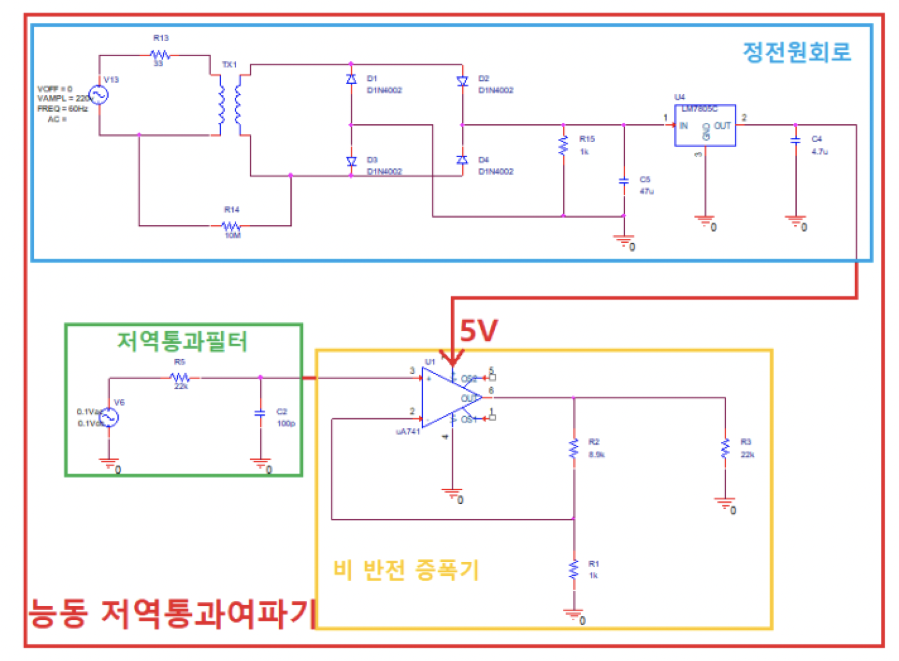

# 목적

1.1 저역통과필터의 주파수 응답특성 이해
- 성능파라미터들의 측정을 통해 각각의 의미 이해

2.1 정전원회로의 전체 동작을 이해
- 다이오드의 동작 특성 이해
- 포락선 검파기 회로의 동작 이해
- 레귤레이터(Regulator) 동작 이해

3.1 OPAMP의 기본동작과 특성을 이해
- 부귀환 증폭 동작 이해
- 비 반전 증폭기 동작 이해

4.1 실험 도구 사용능력 향상
-  실험에 사용되는 계측기(osilloscope, function generator, power supply) 사용 능력 향상 및 계측기 동작 이해 
-  저항, 캐패시터 ,Transformer, Diode, Regulator, OP Amp IC 등의 부품 사용 능력 향상
-  Simulation Tool(Orcad)  사용 능력 향상 

### 회로 설계

더 많은 내용은 보고서확인